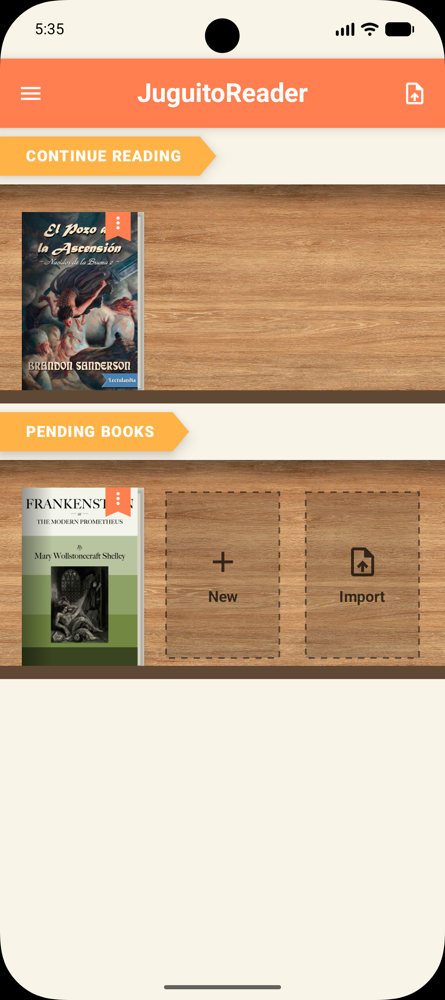
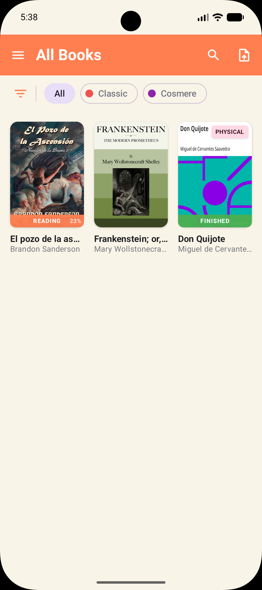
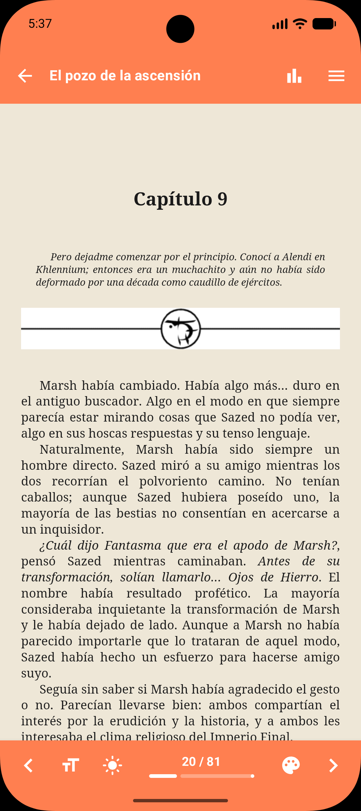
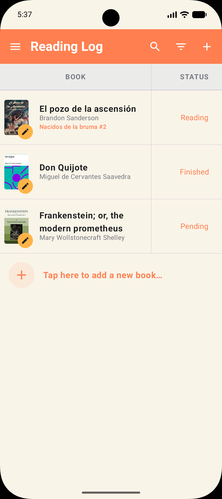
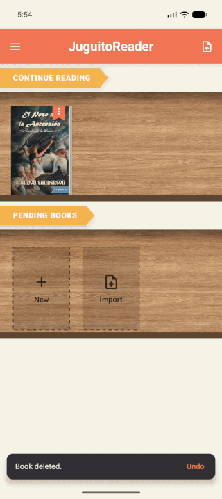
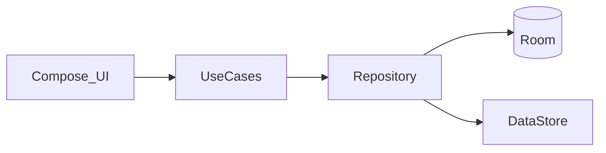

<div align="center">

<br><br>
<a href="README.md">English</a> · <b>Español</b>
<br><br>
<b>Libros digitales y físicos. Una app local.</b><br>
Importa EPUBs, léelos en la app y registra también lo que lees en papel — fechas, nota, comentario, estado y estadísticas de sesión — sin backend.<br>
Hecho con <b>Kotlin, Jetpack Compose, Hilt y Room</b>.
<br><br>
<a href="https://github.com/Juguitoo/juguitoreader-android/actions/workflows/test.yml"></a>


<br><br>
<em>Banner e icono: Daniela.</em>
</div>

---

# Por qué esta app

La mayoría de apps de lectura en Android son visores de EPUB. Yo también leo en papel, y quería un solo sitio para las dos cosas.

JuguitoReader es una biblioteca y un registro **local-first**: los ficheros se quedan en el dispositivo, no hay cuenta, y los libros físicos son feature de producto (`isPhysical`), no un apaño.

En vez de adaptarme a un lector en la nube, monté el gestor que uso de verdad.

---

# Funcionalidades

- Biblioteca digital — importar EPUBs, carpetas y géneros
- Lector integrado — progreso por capítulo, temas, zoom, tiempo de sesión y WPM
- Gestor de lecturas — estado, fechas, valoración y notas en digitales *y* físicos
- Registro — edición de metadatos tipo hoja de cálculo
- Stats por libro — progreso diario y sesiones
- Local-first — Room + DataStore, sin backend
- ES / EN — idioma in-app

---

# Capturas

<div align="center">

&nbsp;&nbsp;
&nbsp;&nbsp;
&nbsp;&nbsp;


Inicio · Biblioteca · Lector · Registro

</div>

## Demo

<div align="center">



</div>

---

# Arquitectura

Clean Architecture + MVVM, todo en el dispositivo.

```
UI (Compose + ViewModel) → UseCase → Repository → Room / DataStore
```

El visor EPUB es un WebView con asset loader local. Los físicos no llevan fichero y reutilizan biblioteca, detalle y stats.



Capas y restricciones: [docs/ARCHITECTURE.md](docs/ARCHITECTURE.md).

---

# Stack

| Categoría | Tecnologías |
|-----------|-------------|
| Lenguaje | Kotlin 2.4 · bytecode JVM 11 |
| UI | Jetpack Compose · Material 3 |
| Arquitectura | Clean Architecture · MVVM · Hilt |
| Persistencia | Room 2.8 · DataStore |
| Async | Coroutines · Flow |
| Tests | JUnit 4 · MockK · Turbine · Truth |

Módulo Gradle único `:app`. minSdk 26 · targetSdk 37.

---

# Cómo ejecutarlo

```bash
git clone https://github.com/Juguitoo/juguitoreader-android.git
cd juguitoreader-android
```

Abre en Android Studio (AGP 9.3+, JDK 17+) y sincroniza Gradle.

```bash
./gradlew test
```

Hook opcional antes de cada push: `.\scripts\install-git-hooks.ps1`

Tests instrumentados: `./gradlew connectedAndroidTest`

---

# Documentación

Las notas de trabajo (en español) están en [`docs/`](docs/): arquitectura, base de datos, roadmap, backlog, issues. [`AGENTS.md`](AGENTS.md) orienta a asistentes IA.

---

# Estado

Pre-release. Pruebas cerradas; aún no está en Play Store.

---

# Licencia

Copyright © 2026 Hugo. Todos los derechos reservados.

El código se publica para **consulta (portfolio)**. No está permitido copiarlo, modificarlo, distribuirlo ni usarlo en otro producto sin permiso escrito. Ver [LICENSE](LICENSE).
