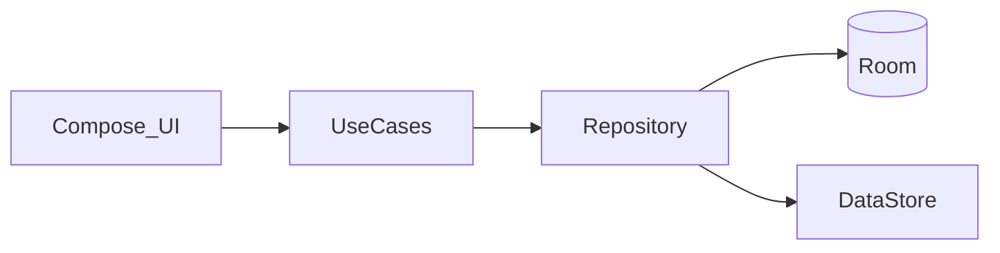

<div align="center">

  

**English** · [Español](README.es.md)  

**Digital books and physical ones. One local app.**  
Import EPUBs, read them in the app, and log books you read on paper — dates, rating, notes, status, and session stats — without a backend.  
Built with **Kotlin, Jetpack Compose, Hilt and Room**.   

  

*Banner and app icon by Daniela.*

</div>

---


# Why this app

Most Android reading apps are EPUB viewers. I also read paper books, and I wanted one place for both.

JuguitoReader is a **local-first** library and reading log: files stay on the device, there is no account, and physical books are a first-class feature (`isPhysical`), not a hack.

Instead of adapting to a cloud reader, I built the manager I actually use.

---


# Features

- Digital library — import EPUBs, folders and genres
- Built-in reader — chapter progress, themes, zoom, session time and WPM
- Reading manager — status, dates, rating and notes for digital *and* physical books
- Registry — spreadsheet-like metadata editing
- Per-book stats — daily progress and reading sessions
- Local-first — Room + DataStore, no backend
- ES / EN — in-app language switch

---


# Screenshots

Portrait PNGs in `[docs/screenshots/](docs/screenshots/)`. Uncomment each `` when the file is there.

## Home

Recent books at a glance.

Add `docs/screenshots/home.png`

## Library

Browse and open digital or physical books.

Add `docs/screenshots/library.png`

## Reader

EPUB reading with theme and zoom.

Add `docs/screenshots/reader.png`

## Registry

Edit metadata in a spreadsheet-style view.

Add `docs/screenshots/registry.png`

## Physical book

A book that exists in the log even when there is no EPUB.

Add `docs/screenshots/physical.png` *(optional)*

---


# Architecture

JuguitoReader follows **Clean Architecture + MVVM**, all on-device.

```
UI (Compose + ViewModel) → UseCase → Repository → Room / DataStore
```

The EPUB viewer is a WebView with a local asset loader. Physical books skip the file and still use the same library, detail, and stats flow.




Layers and constraints: [docs/ARCHITECTURE.md](docs/ARCHITECTURE.md) (Spanish).

---


# Tech stack


| Category     | Technologies                      |
| ------------ | --------------------------------- |
| Language     | Kotlin 2.4 · JVM 11 bytecode      |
| UI           | Jetpack Compose · Material 3      |
| Architecture | Clean Architecture · MVVM · Hilt  |
| Persistence  | Room 2.8 · DataStore              |
| Async        | Coroutines · Flow                 |
| Tests        | JUnit 4 · MockK · Turbine · Truth |


Single Gradle module `:app`. minSdk 26 · targetSdk 37.

---


# Running locally

```bash
git clone https://github.com/Juguitoo/juguitoreader-android.git
cd juguitoreader-android
```

Open in Android Studio (AGP 9.3+, JDK 17+) and sync Gradle.

```bash
./gradlew test
```

Optional pre-push hook: `.\scripts\install-git-hooks.ps1`

Instrumented tests: `./gradlew connectedAndroidTest`

---


# Documentation

Working docs (Spanish) live in `[docs/](docs/)`: architecture, database, roadmap, backlog, known issues. `[AGENTS.md](AGENTS.md)` is for AI assistants in this repo.

---


# Project status

Pre-release. Closed testing; not on the Play Store yet.

---


# License

Copyright © 2026 Hugo. All rights reserved.

Source is published for **portfolio / reference**. You may not copy, modify, distribute, or use it in another product without written permission. See [LICENSE](LICENSE).